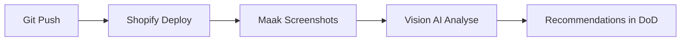

# 👁️ Vision AI Analyst - Visual Screenshot Analysis

## Overzicht

Vision AI gebruikt **OpenAI GPT-4 Vision** om screenshots van je theme te analyseren en visueel te beoordelen op:

- ✅ Visual hierarchy & design quality  
- ✅ Search-first interface implementation
- ✅ Mobile-first/responsive design
- ✅ Brutalist simplicity principles
- ✅ Accessibility (contrast, readability)
- ✅ Brand consistency

## Setup

### 1. API Key instellen

```bash
# In /Users/Frank/Documents/EMMSO NOV/.env
OPENAI_API_KEY=sk-...your-key...
```

### 2. Screenshots toevoegen

Plaats screenshots in `/screenshots` folder:

```
screenshots/
  ├── homepage-desktop.png
  ├── homepage-mobile.png
  ├── search-hero-desktop.png
  ├── search-results-desktop.png
  ├── product-page-desktop.png
  └── collection-page-desktop.png
```

### 3. Run analysis

```bash
cd AI
python3 captain.py
```

Vision AI analyseert automatisch alle screenshots!

## Workflow na Git Push



## Screenshot Tips

**✅ GOED:**
- Full viewport screenshots (1920x1080 desktop, 375x667 mobile)
- Echte content (geen Lorem Ipsum)
- Realistische states (items in cart, search query, etc.)
- Light én dark mode (als van toepassing)

**❌ VERMIJD:**
- Gecropte screenshots
- Browser UI zichtbaar
- Placeholder content
- Te kleine afbeeldingen

## Analyse Output

Vision AI geeft per screenshot:

```json
{
  "screen": "homepage-desktop",
  "score": 75,
  "issues": [
    "Search bar not prominent enough",
    "Low contrast on CTA buttons"
  ],
  "recommendations": [
    "Increase search bar size to 60px",
    "Use #000 on buttons for better contrast"
  ],
  "highlights": [
    "Clean, minimal design",
    "Good use of whitespace"
  ]
}
```

## Scores per Categorie

Vision AI beoordeelt 6 aspecten (elk 0-100):

1. **Visual Hierarchy** - Is belangrijke content direct zichtbaar?
2. **Search-First Design** - Is zoeken prominent aanwezig?
3. **Mobile-First** - Touch targets ≥44px? Thumb-bereik?
4. **Brutalist Simplicity** - Functie > decoratie?
5. **Accessibility** - Contrast ≥4.5:1? Leesbare tekst?
6. **Brand Consistency** - Consistent gebruik kleuren/typografie?

**OVERALL SCORE** = gemiddelde van alle 6

## Integration met Captain

Vision AI draait automatisch bij elke `captain.py` run:

```python
# In captain.py
analysts = [
    ('sarah', 'SarahSEOAnalyst', 'SEO & Technical Audit'),
    ('alex', 'AlexShopifyAnalyst', 'Shopify Platform & E-commerce'),
    ('marcus', 'MarcusPerformanceAnalyst', 'Site Performance & Speed'),
    ('nora', 'NoraVisualAnalyst', 'Visual Design & Branding'),
    ('vision', 'VisionAIAnalyst', '👁️ Visual Screenshot Analysis'),
]
```

## Troubleshooting

**Vision AI score = 0?**
- ✅ Check of OPENAI_API_KEY is ingesteld
- ✅ Check of `/screenshots` folder screenshots bevat
- ✅ Check of screenshots .png/.jpg/.webp zijn

**"No screenshots available"?**
- Voeg minimaal 1 screenshot toe aan `/screenshots`

**API rate limit?**
- Beperk aantal screenshots tot max 5-10
- GPT-4 Vision heeft lagere rate limits

## Kosten

GPT-4 Vision pricing (vanaf nov 2024):
- ~$0.01 per screenshot bij "high detail" mode
- Voor 10 screenshots ≈ $0.10 per analyse run

Totaal per maand bij daily runs: ~$3

## Roadmap

🚧 **Toekomstige features:**
- [ ] Automated screenshot capture via Playwright
- [ ] Visual regression testing (compare before/after)
- [ ] Heatmap overlay (waar kijken gebruikers?)
- [ ] A/B test visual comparison
- [ ] Mobile vs Desktop side-by-side
- [ ] Lighthouse visual metrics integration

